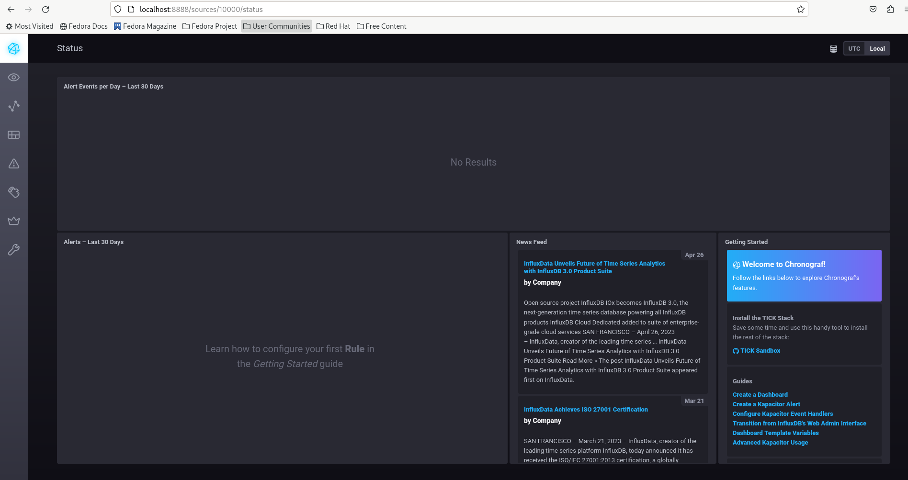
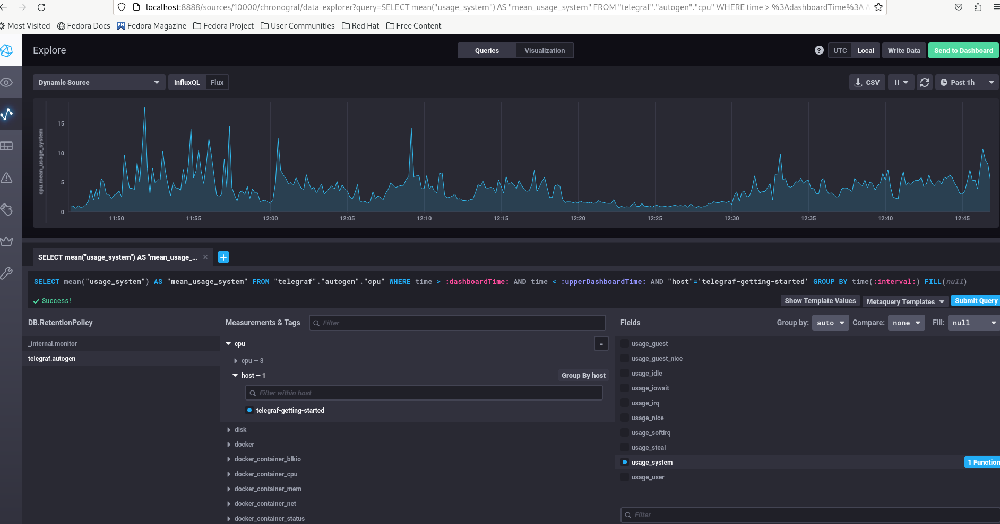
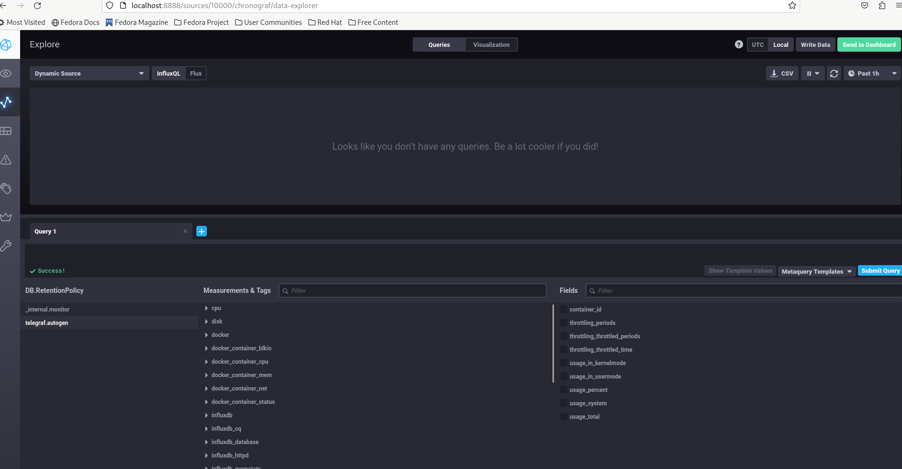

# Домашнее задание к занятию "10.Системы мониторинга"

---
## Задание 1. Вас пригласили настроить мониторинг на проект. На онбординге вам рассказали, что проект представляет из себя платформу для вычислений с выдачей текстовых отчетов, которые сохраняются на диск. Взаимодействие с платформой осуществляется по протоколу http. Также вам отметили, что вычисления загружают ЦПУ. Какой минимальный набор метрик вы выведите в мониторинг и почему?

### Ответ 1:

Для решения поставленной задачи достаточно наличие следующих метрик:
- проверка доступности сервиса
- проверка загрузки ЦПУ

## Задание 2. Менеджер продукта посмотрев на ваши метрики сказал, что ему непонятно что такое RAM/inodes/CPUla. Также он сказал, что хочет понимать, насколько мы выполняем свои обязанности перед клиентами и какое качество обслуживания. Что вы можете ему предложить?

### Ответ 2:

Можно предложить использовать подходы SLO/SLA/SLI. Напирмер: 
- сбор статистики доступности сервиса
- сбор статистики web-сервера на предмет 1хх/2хх/3хх/4хх/5хх событий 
- мониторинг времени формирования отчета
- мониторинг количества несформированных отчетов

## Задание 3. Вашей DevOps команде в этом году не выделили финансирование на построение системы сбора логов. Разработчики в свою очередь хотят видеть все ошибки, которые выдают их приложения. Какое решение вы можете предпринять в этой ситуации, чтобы разработчики получали ошибки приложения?

### Ответ 3:

Использовать бесплатные системы или написать скрипт, который будет собирать необходимые логи. После сбора предоставить разработчикам.

## Задание 4. Вы, как опытный SRE, сделали мониторинг, куда вывели отображения выполнения SLA=99% по http кодам ответов. Вычисляете этот параметр по следующей формуле: summ_2xx_requests/summ_all_requests. Данный параметр не поднимается выше 70%, но при этом в вашей системе нет кодов ответа 5xx и 4xx. Где у вас ошибка?

### Ответ 4:

Ошибка в том, что код 2** используется только для мониторинга доступности.

## Задание 5. Опишите основные плюсы и минусы pull и push систем мониторинга.

### Ответ 5:

#### Push

- Плюсы:
  - Упрощение репликации данных в разные системы мониторинга или их резервные копии (на клиенте настраивается конечная точка отправки или набор таких точек)
  - Более гибкая настройка отправки пакетов данных с метриками (на каждом клиенте задается объем данных и частоту отправки)
  - UDP является менее затратным способом передачи данных, вследствии чего может вырости производительность сбора метрик (обратной стороной медали является гарантия доставки пакетов)

- Минусы:
  - Каждая нода настраивается индивидуально, нет централизованного управления метриками. 
  - Возможность возникновения очередей, и большего количества повторяющихся запросов.
  - Нода не знает успешно доходят её метрики или нет.
  
#### Pull

- Плюсы:
  - Легче контролировать подлинность данных (гарантия опроса только тех агентов, которые настроены в системе мониторинга)
  - Можно настроить единый proxy-server до всех агентов с TLS (таким образом мы можем разнести систему мониторинга и агенты, с гарантией безопасности их взаимодействия)
  - Упрощенная отладка получения данных с агентов (так как данные запрашиваются посредством HTTP, можно самостоятельно запрашивать эти данные, используя ПО вне системы мониторинга)

- Минусы:
  - Более требователен к ресурсам
  - Нагрузка на сеть.


## Задание 6. Какие из ниже перечисленных систем относятся к push модели, а какие к pull? А может есть гибридные?

### Ответ 6:

- Push/Pull
  - Prometheus
  - Zabbix
  - VictoriaMetrics
- Push
  - TICK
- Pull
  - Nagios

## Задание 7. Склонируйте себе репозиторий и запустите TICK-стэк, используя технологии docker и docker-compose.

В виде решения на это упражнение приведите скриншот веб-интерфейса ПО chronograf (http://localhost:8888).

P.S.: если при запуске некоторые контейнеры будут падать с ошибкой - проставьте им режим Z, например ./data:/var/lib:Z

### Ответ 7:



## Задание 8. Перейдите в веб-интерфейс Chronograf (http://localhost:8888) и откройте вкладку Data explorer.
        
    - Нажмите на кнопку Add a query
    - Изучите вывод интерфейса и выберите БД telegraf.autogen
    - В `measurments` выберите cpu->host->telegraf-getting-started, а в `fields` выберите usage_system. Внизу появится график утилизации cpu.
    - Вверху вы можете увидеть запрос, аналогичный SQL-синтаксису. Поэкспериментируйте с запросом, попробуйте изменить группировку и интервал наблюдений.

Для выполнения задания приведите скриншот с отображением метрик утилизации cpu из веб-интерфейса.

### Ответ 8:



## Задание 9. Изучите список [telegraf inputs](https://github.com/influxdata/telegraf/tree/master/plugins/inputs). 
Добавьте в конфигурацию telegraf следующий плагин - [docker](https://github.com/influxdata/telegraf/tree/master/plugins/inputs/docker):
```
[[inputs.docker]]
  endpoint = "unix:///var/run/docker.sock"
```

Дополнительно вам может потребоваться донастройка контейнера telegraf в `docker-compose.yml` дополнительного volume и 
режима privileged:
```
  telegraf:
    image: telegraf:1.4.0
    privileged: true
    volumes:
      - ./etc/telegraf.conf:/etc/telegraf/telegraf.conf:Z
      - /var/run/docker.sock:/var/run/docker.sock:Z
    links:
      - influxdb
    ports:
      - "8092:8092/udp"
      - "8094:8094"
      - "8125:8125/udp"
```

После настройке перезапустите telegraf, обновите веб интерфейс и приведите скриншотом список `measurments` в 
веб-интерфейсе базы telegraf.autogen . Там должны появиться метрики, связанные с docker.

Факультативно можете изучить какие метрики собирает telegraf после выполнения данного задания.

### Ответ 9:

<details><summary></summary>

Решил добавить владельца сокета в telegraf docker-compose.yml:

```
[root@fedora sandbox]# stat -c '%g' /var/run/docker.sock
976

```

Изменил контейнер telegraf в docker-compose.yml:

```
  telegraf:
    # Full tag list: https://hub.docker.com/r/library/telegraf/tags/
    build:
      context: ./images/telegraf/
      dockerfile: ./${TYPE}/Dockerfile
      args:
        TELEGRAF_TAG: ${TELEGRAF_TAG}
    image: "telegraf"
    privileged: true
    user: telegraf:976
    environment:
      HOSTNAME: "telegraf-getting-started"
    # Telegraf requires network access to InfluxDB
    links:
      - influxdb
    volumes:
      # Mount for telegraf configuration
      - ./telegraf/telegraf.conf:/etc/telegraf/telegraf.conf:Z
      # Mount for Docker API access
      - /var/run/docker.sock:/var/run/docker.sock:Z
    depends_on:
      - influxdb
    ports:
      - "8092:8092/udp"
      - "8094:8094"
      - "8125:8125/udp"
```
</details>


